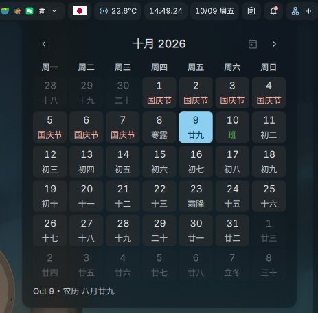

# Chinese Calendar for [DankMaterialShell](https://github.com/DankMaterialShell/DankMaterialShell)



Display Chinese lunar calendar (农历) with holiday information directly in your status bar.

## Features

- **Status Bar Widget**: Customizable display of Gregorian and Lunar dates.
- **Overview Card**: Small cards show today's date, lunar date, solar term and holiday countdown. Enlarge the card to at least 3 × 4 cells for a full lunar month calendar with month navigation, date selection and a return-to-today button.
- **Full Lunar Calendar**: Popup view showing lunar dates, solar terms (节气), and festivals.
- **Native DMS Calendar Style**: Both the overview card and bar popup use DMS's `DMonthGrid`, with native month navigation, day cells, selection, hover effects, week numbers and first-day-of-week settings. Click the month title to choose a month.
- **Holiday Integration**: Real-time indication of holidays and make-up workdays (调休) sourced from `holiday-cn`.
- **Smart Navigation**: Navigate between months, click to jump to specific dates, and quick return to "Today".
- **Detailed Info**: View detailed information for any selected date, including days until the next holiday.

## Requirements

- DankMaterialShell 1.7 or later.
- **System Package**: `ccal` is required for generating lunar calendar data.
- **System Package**: `curl` is required for fetching holiday definitions.
- Network connection for holiday data updates.

## Configuration

To add the overview card, enable Chinese Calendar in Plugins, open the DDash overview, enter Edit mode, and select **Add widget → 农历日历**. New cards default to 4 × 4 cells. Resize an existing summary card to at least 3 × 4 cells to display the full month calendar. The status bar widget remains available separately.

1. Go to Plugin Settings.
2. Customize the **Date Format** string (e.g., `ddd MM月dd日 LL`).
   - Supported tokens: `LL` (Lunar Date), `yyyy` (Year), `MM` (Month), etc.

## Install ccal

### Arch Linux / Manjaro
```bash
yay -S ccal
```

## Permissions

- `settings_read` / `settings_write`
- `process`
- `network`

## Credits

This project is based on and powered by:

- **[ccal](http://ccal.chinesebay.com/ccal/ccal.htm)**: Provides the core lunar calendar calculation engine.
- **[holiday-cn](https://github.com/NateScarlet/holiday-cn)**: Provides the holiday arrangement data source.

## Feedback & Contributions

Suggestions for improvements and feature requests are always welcome.
If you have ideas, encounter issues, or want to see new features, feel free to open an issue or submit a pull request.
